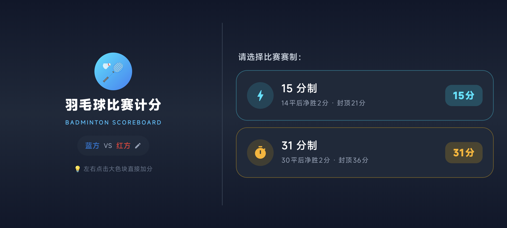
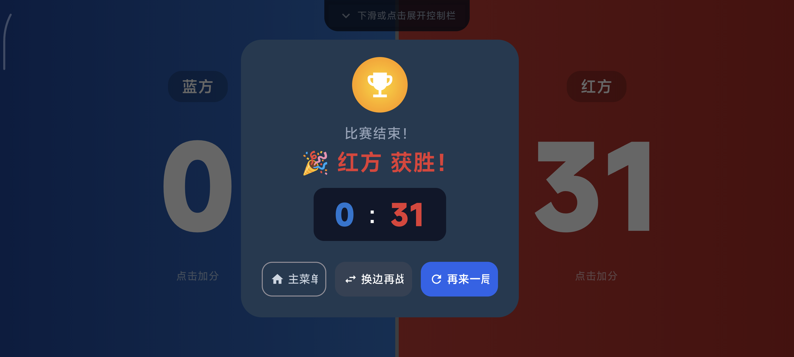

# 🏸 羽毛球比赛计分器 (Badminton Scoreboard)

一款专为羽毛球比赛设计的安卓计分软件，界面简洁醒目，支持大屏横向双色计分与标准加分赛规则。

---

## 🌟 核心特性

- **📱 赛制选择与自适应布局**：
  - 支持 **15 分制** 与 **31 分制** 直选。
  - 支持主页横屏与竖屏自适应切换，大卡片一目了然。
  - 支持自定义对战双方名称（默认：蓝方 VS 红方）。
- **🏸 专业羽毛球加分赛（Deuce）与封顶机制**：
  - **15 分制**：战至 14-14 平后进入加分赛，须净胜 2 分胜出，**21 分封顶**。
  - **31 分制**：战至 30-30 平后进入加分赛，须净胜 2 分胜出，**36 分封顶**。
  - 触发加分赛时自动提示当前赛点与封顶状态。
- **⚡ 横屏沉浸式极简计分**：
  - 进入比赛自动锁定全屏横屏模式，左右双色高对比分区（科技蓝 vs 激情红）。
  - 单击大色块直接加分，配有触感振动反馈与数字弹性缩放回弹动画。
  - 显示发球方指示标（🏸 发球）。
- **🎛️ 顶部居中多功能悬浮控制栏**：
  - 双方独立 【+1 / -1】 加减分按钮。
  - 支持【撤销 (Undo)】、【换边 (Swap)】、【重置局分 (Reset)】。
  - **3.5 秒无触摸自动隐藏**，手指下滑或点击指示条即可滑出。
- **🏆 胜利结算弹窗**：
  - 比赛达到胜负条件后自动弹出获胜奖杯弹窗。
  - 清晰展示双方最终比分，提供【主菜单】、【换边再战】、【再来一局】一键重置。

---

## 📸 应用界面截图

| 主页赛制选择（横屏自适应） | 比赛计分与加分赛提示 | 比赛胜利结算弹窗 |
| :---: | :---: | :---: |
|  |  |  |

---

## 🛠️ 技术栈

- **Language**: Kotlin 1.9.22
- **UI Framework**: Jetpack Compose (Material3)
- **Compile SDK**: 34 (Android 14)
- **Minimum SDK**: 24 (Android 7.0+)
- **Build Tool**: Gradle 8.4 + AGP 8.3.0

---

## 🚀 编译与安装

```bash
# 编译 Debug APK
./gradlew assembleDebug

# 安装到连接的 Android 设备
adb install -r app/build/outputs/apk/debug/app-debug.apk
```

---

## 📄 License
MIT License
